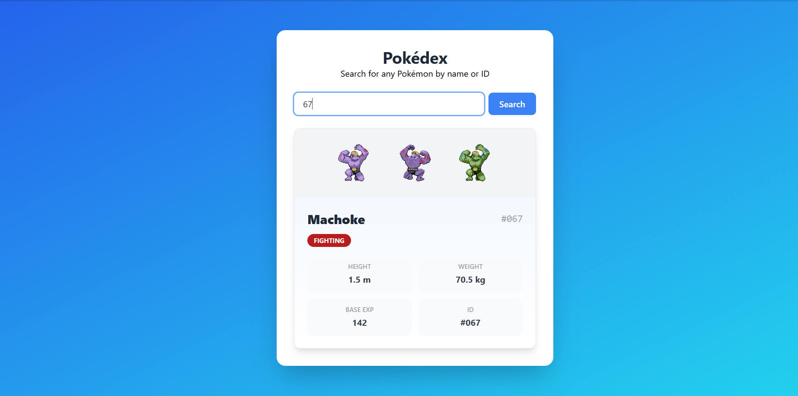

# Project Description

this project is a dynamic pokedex that allows users to search for any pokemon by name or Id. when a user click on search, the application send a live request to the pokeAPI and dynamicaly display a pokemon card displaying the Pokémon's name, ID, height, weight...

# Technologies Used

The technology i have used:
HTML5: to structure my UI
Vanilla js: to fetch my data 
Tailwind css: to style my page like the UI 

# Key Learnings

I learned how to use Tailwind a bit insteed of using css. 

Understanding the difference between a promise and its resolved value was a key concept. The fetch() function returns a promise that resolves to a response object.

Trying to understand the DOM manipulation. Rather than hardcoding HTML for each pokemon,js build the card dynamically using queryselector,createElement...

# challenges faced 
1.The first change the html page remain static cause  i was puting the script tag, this one <script src="script.js"> inside the head og HTML file insteed of the body. 

2. i tried to fetch the data but when i was clicking on the search button i was not fiding anything and the problem was that i was fetching the wrong API 

# Screenshot of the final application

